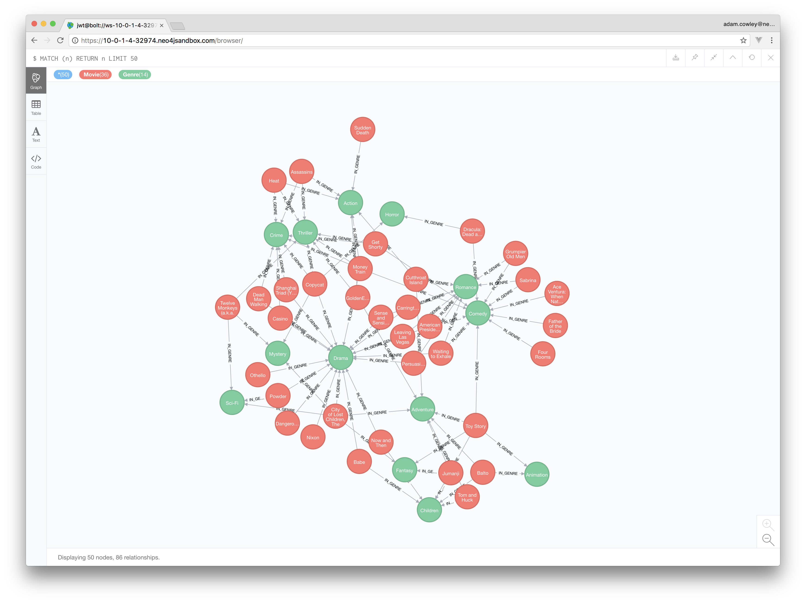

# Getting Started with Graph Database

> Neo4j's Adam Cowley on the power of connected data and the software you need to master right now to make the most of it.
>
> This repository accompanies the article in Issue 300 Net Magazine, December 2017.




In an ever-increasingly connected world where electronic devices in our hands and our pockets are generating terabytes of data per day, there is a big challenge in making sense of the sheer volume of data.  *Graph databases* help with this, by allowing for the compination of disparate, siloed datasets into a single view and enabling DBA's to ask questions that were previously not possible with existing *relational* or *document databases*.

Although there is certainly value in the data we hold, but it is the connections between data that starts to add colour.  Creating or inferring relationships between your records can yield real insights to a dataset.  Traversing a hierarchical list of categories can make product discovery a simple process; storing sequential events in a linked list can make it easier to track behaviour and also make predictions on what will happen next.

Some consider the initial learning curve to be steep when approaching from a background of relational databases. However, once you have mastered the key terminologies and how they relate to each other it should be an easy ride.  In essence, a Graph is formed of entities known as **nodes** (or vertices depending on your educational background) marked by one or more **Llabels** and connected together by **relationships**.  Relationships, also known as edges, are directed and named with a **yype**.  Both Nodes and Relationships can hold arbitrary **properties** as key-value pairs.

## The Science
But why do graphs handle these relationships so well?  Compared to Relational Databases that rely on expensive set operations or intricate indexes, the index-free adjacency of a native graph database enables the underlying storage engine to follow direct pointers between records at an algorithmic cost of O(1).  As a Relational Database grows, the performance of larger queries will degrade with the computation of larger intermediate sets.  On the other end of the scale, the performance of a Graph Database depends entirely on the proportion of the graph that you choose to search, rather than the overall size of the data.

## Whiteboard Friendly Data Modelling
Designing your data model is the first step on the path to Graph success.  Building your data model is best achieved with a whiteboard and a domain expert.  The flexibility of a Graph will enable you to map the phrases and terminology of your domain directly into the data model. As a general rule, the majority of records can be mapped directly to a Node with a label to identify the database table.  Foreign keys or pivot tables between will typically become a relationship.

The schemaless nature of a graph database means, that the data model is only as permanent as the model on the whiteboard.  Adding properties, labels or relationships can be as easy as redrawing on the whiteboard, meaning the model can evolve with you as the requirements of your business change.

## Introducing Cypher
The main access point to Neo4j is the Cypher query language.  Cypher is a declarative query language, purpose built as a replacement for Gremlin, with the aim of making traversing a graph as simple as possible.  The language works to match patterns using an Ascii art-style syntax, producing a query as close to the whiteboard model as possible.  Cypher has four key statements.

### MATCH
The equivalent of SQL's `FROM ... JOIN` query comes in the form of `MATCH`.  The `MATCH` statement enables you to define a pattern of nodes and/or relationships.  These results can then be subsequently filtered using `WHERE` clauses, before using the `RETURN` keyword to choose what to return.

```
MATCH (me:Person)-[:KNOWS]->(friend:Person)
WHERE me.name = "Adam"
RETURN friend ORDER BY friend.name ASC LIMIT 10
```

Similar to a `LEFT JOIN` in SQL, the `OPTIONAL MATCH` statement can be used in cases where a relationship may not exist. Otherwise any patterns from the `MATCH` clause not found in the data will be excluded from the result set.

### CREATE
Cypher uses the `CREATE` keyword to add records to the database.  This can be used to create nodes, relationships between nodes or entire patterns.

```
CREATE (:Person {name: "Adam"})
   -[:LIVES_IN]->(:Location {name: "Swindon"})
```

### MERGE
Where a record or relationship might already exists, the `MERGE` keyword can be used to either find or create a record based on properties and then optionally add additional properties depending on the context.

```
MERGE (adam:Person {name: "Adam"})
SET adam.twitter = '@adamcowley'
ON CREATE SET adam.created_at = timestamp()
ON MATCH SET adam.updated_at = timestamp()
```

### DELETE
To remove data from the graph, Cypher provides the `DELETE` statement.  After matching a pattern, named elements of that pattern can be deleted.

```
MATCH (adam:Person)-[r:KNOWS]->()
DELETE r
```

### WITH
Special mention should also go to `WITH`, a clause similar to `RETURN` which allows for results or aggregations to be carried through the query.  This allows for more complex queries than in standard SQL implementations.

```
MATCH (adam:Person)-[r:KNOWS]->(friend:Person)
WITH adam, COLLECT(friend) AS friends
MATCH (adam:Person)-[:RELATED_TO]->(relative:Person)
RETURN adam, friends, collect(relative) AS relatives
```

Since the 3.0 release in 2016, Neo4j has also supported User Defined Procedures; packages written in any JVM language, compiled and deployed as a `.jar` file to the `plugins` folder of a Neo4j instance for invocation directly in Cypher queries. UDF's allow for finer grained control and transparently support functionality not otherwise available in Cypher. The community-driven APOC library (https://github.com/neo4j-contrib/neo4j-apoc-procedures) is a great example, containing a wide range of procedures and functions.

## Importing Data
The simplest way to import data into Neo4j is to use the Cypher `LOAD CSV` statement.  For example, say we would like to build a REST API serving movie information and [have movie information in the form of a CSV file](import/movies.csv) with a unique ID, title and a unique identifier for the director:

```
id,title,director
1,The Godfather,francis-ford-coppola
2,The Godfather 2,francis-ford-coppola
3,Goodfellas,martin-scorsese
4,Pulp Fiction,quentin-tarantino
```

In order to quickly find movies by their director, we can create a node for each director.  This will eliminate the need to scan indexes on the movie nodes and reduce the amount of nodes touched by each query.  As we want one node for each director, we need to create a unique constraint against the id property on each Director node.

```
CREATE CONSTRAINT ON (d:Director) ASSERT THAT d.id IS UNIQUE
```

Once the constraint has been set up, we can start to load our CSV into the database.  The following snippet will load a CSV file `WITH HEADERS` in the first line, from a file called `movies.csv` and assign each row in turn to the variable `line`. It will then find or create a Director node with an ID matching the director column, create a movie with an `id` and `title` property, before finally creating a `DIRECTED_BY` relationship to the director:

```
LOAD CSV WITH HEADERS FROM "file:///movies.csv" AS line
MERGE  (d:Director {id: line.director})
CREATE (m:Movie {id: line.id, title: line.title})
CREATE (m)-[:DIRECTED_BY]->(d)
```

Once the data has been loaded, we can then use a `MATCH` query to find any movies directed by a particular director:

```
MATCH (m:Movie)-[:DIRECTED_BY]->(d:Director {id: “francis-ford-coppola”})
RETURN m.id, m.title
```

No matter which order you write this query, the cost-based query planner will evaluate database statistics and rewrite the query into it's most optimal form.

## Build an Application with Neo4j
Neo4j has officially supported drivers for .NET, Java, JavaScript and Python as well as community drivers for PHP, Go, Elixir and Ruby, amongst others.  For now, we will focus on building a simple web application using the official JavaScript driver, which can be installed using npm or yarn.  To get started, first create a new project and install `express` and `neo4j-driver` using NPM:

```
npm init
npm install --save express neo4j-driver
```

Inside a new [`app.js`](app.js) file, we first need to create a connection to the server using Neo4j's bolt protocol.  To handle incoming requests, we will set up an express route which will create a new database session and execute the query before returning the results as a JSON array:

```
const neo4j = require("neo4j-driver").v1
const driver = new neo4j.driver("bolt://localhost", neo4j.auth.basic("neo4j", "neo"))

app.get('/api/movies/:director_id’, (req, res) => {
   const session = driver.session()
   const query = "MATCH (m:Movie)-[:DIRECTED_BY]->(d:Director {id: {director_id}}) RETURN m"

   const params = {director_id: req.params.director_id}
   session.run(query, params)
       .then(result => {
           res.send(result.records.map(record => {
               return record.get("m").properties
           }))
       }, e => {
           res.status(500).send(e)
       })
       .finally(() => {
           return session.close()
       })
})
```
Here, the query parameters are wrapped in braces for performance and security reasons.

Now if we run our app, and open a browser to `http://localhost:8080/api/movies/quentin-tarantino`, we will see an array containing "Pulp Fiction":

```
[{"id":4,"title":"Pulp Fiction"}]
```

## Conclusion

Despite the initial learning curve, the barrier to entry is relatively low.  By using the data integration procedures (jdbc, mongodb, json, xml, etc) contained within the APOC library, you can start migrating your existing dataset within minutes. The Index-free adjacency of the Graph means that queries on highly connected data will suffer no performance degradation as the size of the database grows.  Who knows, looking at your dataset as a graph may reveal insights that you'd never have thought of?

## Boxout 1: Graph's for good

Graph databases are fast becoming a key differentiator for big business today with over half of the global 2000 either using or piloting Graph Databases.

Google realised at an early stage that the connection between pages on the web are as important as the content on the page. Using Larry Page’s PageRank, Google were able to beat the likes of Altavista and Lycos by providing better results. The PageRank algorithm ranks pages based on the transitive strength of the adjacent documents that the page is linked to by.

Since then, Google has invested significant efforts into graph technology, also using its Knowledge Graph to power their machine learning algorithms.  Since 2016, this platform has enhanced Google products used by millions on a daily basis, from smart replies in your Inbox to supporting deep neural networks to power the image recognition system in Google Photos.

The use of graph databases is not only restricted to the web; applications of graph databases reach far and wide.  In medicine, Graph Databases have applications from personalised care to mapping the progression of cancer through cells.

In 2016, after 11.5 million documents were leaked from Panamanian law firm Mossack Fonseca, the ICIJ connected these documents to individuals, companies and addresses, exposing  how billionaires, sports stars and politicians used tax havens to hide their money.  The Panama Papers investigation was subsequently awarded the 2017 Pulitzer Prize for Explanatory Reporting.

Amongst the findings were a $2bn paper trail leading to Russian president Vladimir Putin and links to offshore companies that forced the then Icelandic Prime Minister Sigmundur Davíð Gunnlaugsson to resign.


Further afield, NASA has enriched half a century of knowledge in their "Lessons Learned Database", with a graph based search tool that allows discovery of the most relevant information in seconds that would previously have taken days or even weeks.


## Boxout 2: Resources

### Graph Databases book
The Graphista's bible - this book, published in 2015 by Ian Robinson, Jim Webber & Emil Eifrem, is still the go guide to Graph Databases, providing a great overview in graph data modeling and use-cases, applying those to Neo4j based applications and insights in implementation details and use of graph algorithms
http://graphdatabases.com/

### Neo4j Free Download
Download the latest version of the open-source Neo4j database and get up and running in a matter of minutes.
http://neo4j.com/download

### Decyphering Your Graph
A superb guide on how to model your graph filmed at Graph Connect 2017 in London by Dom Davies, CTO of Tech Marionette.
https://www.youtube.com/watch?v=5d4wh2wBxCU

### GraphGists
Hundreds of graph across 8 use cases including examples from Real-Time Recommendations to “Graph of Thrones”
https://neo4j.com/graphgists/

### APOC
A community-driven library of procedures covering everything from simple text functions to import and export utilities and spatial functionality.
https://github.com/neo4j-contrib/neo4j-apoc-procedures

### Neo4j Graph Algorithms
A library containing efficient implementations of common graph algorithms callable from Cypher as user defined procedures.
https://neo4j-contrib.github.io/neo4j-graph-algorithms/

### Cypher Refcard
The go-to reference cheat sheet for the Cypher query language.
https://neo4j.com/docs/cypher-refcard/current/


## Author Information
- *Name:* Adam Cowley
- *URL:* adamcowley.co.uk
- *Twitter handle:* @adamcowley
- *Job title:* Delivery Consultant, Neo4j
- *Areas of expertise:* Web apps, Graph Databases, NodeJS

